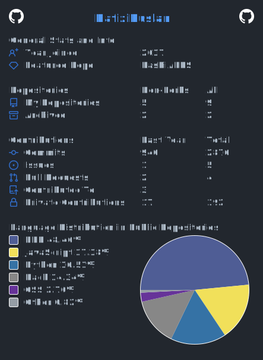

# Hi there 👋



<!--
**HafiziRuslan/HafiziRuslan** is a ✨ _special_ ✨ repository because its `README.md` (this file) appears on your GitHub profile.

Here are some ideas to get you started:

- 🔭 I’m currently working on ...
- 🌱 I’m currently learning ...
- 👯 I’m looking to collaborate on ...
- 🤔 I’m looking for help with ...
- 💬 Ask me about ...
- 📫 How to reach me: ...
- 😄 Pronouns: ...
- ⚡ Fun fact: ...
-->

<!--START_SECTION:waka-->


**🐱 My GitHub Data** 

> 📦 51.8 kB Used in GitHub's Storage 
 > 
> 🏆 49 Contributions in the Year 2026
 > 
> 💼 Opted to Hire
 > 
> 📜 9 Public Repositories 
 > 
> 🔑 0 Private Repositories 
 > 
**I'm a Night 🦉** 

```text
🌞 Morning                514 commits         ████░░░░░░░░░░░░░░░░░░░░░   16.52 % 
🌆 Daytime                598 commits         █████░░░░░░░░░░░░░░░░░░░░   19.22 % 
🌃 Evening                928 commits         ███████░░░░░░░░░░░░░░░░░░   29.83 % 
🌙 Night                  1071 commits        █████████░░░░░░░░░░░░░░░░   34.43 % 
```
📅 **I'm Most Productive on Tuesday** 

```text
Monday                   465 commits         ████░░░░░░░░░░░░░░░░░░░░░   14.95 % 
Tuesday                  609 commits         █████░░░░░░░░░░░░░░░░░░░░   19.58 % 
Wednesday                512 commits         ████░░░░░░░░░░░░░░░░░░░░░   16.46 % 
Thursday                 599 commits         █████░░░░░░░░░░░░░░░░░░░░   19.25 % 
Friday                   319 commits         ███░░░░░░░░░░░░░░░░░░░░░░   10.25 % 
Saturday                 327 commits         ███░░░░░░░░░░░░░░░░░░░░░░   10.51 % 
Sunday                   280 commits         ██░░░░░░░░░░░░░░░░░░░░░░░   09.00 % 
```


📊 **This Week I Spent My Time On** 

```text
🕑︎ Time Zone: Asia/Kuala_Lumpur

💬 Programming Languages: 
Other                    11 hrs 5 mins       ███████████████░░░░░░░░░░   59.41 % 
Python                   5 hrs 6 mins        ███████░░░░░░░░░░░░░░░░░░   27.35 % 
Bash                     43 mins             █░░░░░░░░░░░░░░░░░░░░░░░░   03.88 % 
YAML                     40 mins             █░░░░░░░░░░░░░░░░░░░░░░░░   03.62 % 
JSON                     31 mins             █░░░░░░░░░░░░░░░░░░░░░░░░   02.83 % 

🔥 Editors: 
Edge                     7 hrs 21 mins       ██████████░░░░░░░░░░░░░░░   39.42 % 
VS Code                  6 hrs 24 mins       █████████░░░░░░░░░░░░░░░░   34.31 % 
MobaXterm                1 hr 15 mins        ██░░░░░░░░░░░░░░░░░░░░░░░   06.77 % 
Notepad++                1 hr 13 mins        ██░░░░░░░░░░░░░░░░░░░░░░░   06.59 % 
WinSCP:SFTP,FTP,WebDAV,S31 hr 8 mins         ██░░░░░░░░░░░░░░░░░░░░░░░   06.14 % 

🐱‍💻 Projects: 
raspiaprs                10 hrs 58 mins      ███████████████░░░░░░░░░░   58.73 % 
Unknown Project          4 hrs 54 mins       ███████░░░░░░░░░░░░░░░░░░   26.33 % 
pslhtg                   2 hrs               ███░░░░░░░░░░░░░░░░░░░░░░   10.80 % 
HafiziRuslan             46 mins             █░░░░░░░░░░░░░░░░░░░░░░░░   04.14 % 

💻 Operating System: 
Windows                  18 hrs 40 mins      █████████████████████████   100.00 % 
```

**I Mostly Code in PHP** 

```text
PHP                      4 repos             ██████████░░░░░░░░░░░░░░░   40.00 % 
Python                   2 repos             █████░░░░░░░░░░░░░░░░░░░░   20.00 % 
HTML                     2 repos             █████░░░░░░░░░░░░░░░░░░░░   20.00 % 
CSS                      1 repo              ██░░░░░░░░░░░░░░░░░░░░░░░   10.00 % 
C#                       1 repo              ██░░░░░░░░░░░░░░░░░░░░░░░   10.00 % 
```


**Timeline**


<!--END_SECTION:waka-->

## Recent Activity

This is a list of my most recent activity on GitHub.
<!--RECENT_ACTIVITY:start-->
1. ⭐ Starred [tailscale/tailscale-android](https://github.com/tailscale/tailscale-android)<br>
2. 💪 Opened PR [#1](undefined) in [HafiziRuslan/PiStar-LastHeard-Telegram](https://github.com/HafiziRuslan/PiStar-LastHeard-Telegram)<br>
3. 💪 Opened PR [#14](undefined) in [HafiziRuslan/RasPiAPRS](https://github.com/HafiziRuslan/RasPiAPRS)<br>
4. 💪 Opened PR [#13](undefined) in [HafiziRuslan/RasPiAPRS](https://github.com/HafiziRuslan/RasPiAPRS)<br>
5. 💪 Opened PR [#12](undefined) in [HafiziRuslan/RasPiAPRS](https://github.com/HafiziRuslan/RasPiAPRS)<br>
6. ❌ Closed PR [#11](undefined) in [HafiziRuslan/RasPiAPRS](https://github.com/HafiziRuslan/RasPiAPRS)<br>
<!--RECENT_ACTIVITY:end-->
<!--RECENT_ACTIVITY:last_update-->
Activity updated: 2026-01-03T19:14:55+0800
<!--RECENT_ACTIVITY:last_update_end-->
