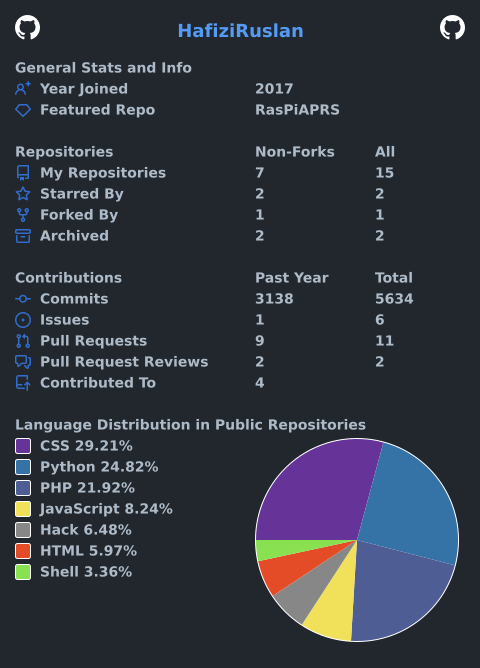

# Hi there 👋

My Repositories

- [GitHub](https://github.com/HafiziRuslan)
- [GitLab](https://gitlab.com/hafiziruslan)
- [Codeberg](https://codeberg.org/hafiziruslan)
- [Gitea](https://gitea.com/HafiziRuslan)

## About



<!--
**HafiziRuslan** is a ✨ _special_ ✨ repository because its `README.md` (this file) appears on your GitHub profile.

Here are some ideas to get you started:

- 🔭 I’m currently working on ...
- 🌱 I’m currently learning ...
- 👯 I’m looking to collaborate on ...
- 🤔 I’m looking for help with ...
- 💬 Ask me about ...
- 📫 How to reach me: ...
- 😄 Pronouns: ...
- ⚡ Fun fact: ...
-->

<!--START_SECTION:waka-->


**🐱 My GitHub Data** 

> 📦 54.5 kB Used in GitHub's Storage 
 > 
> 🏆 687 Contributions in the Year 2026
 > 
> 💼 Opted to Hire
 > 
> 📜 13 Public Repositories 
 > 
> 🔑 1 Private Repositories 
 > 
**I'm a Night 🦉** 

```text
🌞 Morning                615 commits         ████░░░░░░░░░░░░░░░░░░░░░   16.44 % 
🌆 Daytime                641 commits         ████░░░░░░░░░░░░░░░░░░░░░   17.14 % 
🌃 Evening                1115 commits        ███████░░░░░░░░░░░░░░░░░░   29.81 % 
🌙 Night                  1369 commits        █████████░░░░░░░░░░░░░░░░   36.60 % 
```
📅 **I'm Most Productive on Tuesday** 

```text
Monday                   564 commits         ████░░░░░░░░░░░░░░░░░░░░░   15.08 % 
Tuesday                  715 commits         █████░░░░░░░░░░░░░░░░░░░░   19.12 % 
Wednesday                636 commits         ████░░░░░░░░░░░░░░░░░░░░░   17.01 % 
Thursday                 657 commits         ████░░░░░░░░░░░░░░░░░░░░░   17.57 % 
Friday                   417 commits         ███░░░░░░░░░░░░░░░░░░░░░░   11.15 % 
Saturday                 374 commits         ██░░░░░░░░░░░░░░░░░░░░░░░   10.00 % 
Sunday                   377 commits         ███░░░░░░░░░░░░░░░░░░░░░░   10.08 % 
```


📊 **This Week I Spent My Time On** 

```text
🕑︎ Time Zone: Asia/Kuala_Lumpur

💬 Programming Languages: 
Python                   15 hrs 39 mins      ███████████████░░░░░░░░░░   58.95 % 
Bash                     4 hrs 22 mins       ████░░░░░░░░░░░░░░░░░░░░░   16.46 % 
PHP                      2 hrs 54 mins       ███░░░░░░░░░░░░░░░░░░░░░░   10.97 % 
TOML                     1 hr 1 min          █░░░░░░░░░░░░░░░░░░░░░░░░   03.83 % 
Markdown                 38 mins             █░░░░░░░░░░░░░░░░░░░░░░░░   02.39 % 

🔥 Editors: 
VS Code                  26 hrs 18 mins      █████████████████████████   99.08 % 
Edge                     14 mins             ░░░░░░░░░░░░░░░░░░░░░░░░░   00.92 % 

🐱‍💻 Projects: 
raspiaprs                13 hrs 34 mins      █████████████░░░░░░░░░░░░   51.10 % 
mmdvmlhbot               5 hrs 27 mins       █████░░░░░░░░░░░░░░░░░░░░   20.55 % 
RasPi-Backups            4 hrs 25 mins       ████░░░░░░░░░░░░░░░░░░░░░   16.70 % 
WebCode                  2 hrs 50 mins       ███░░░░░░░░░░░░░░░░░░░░░░   10.73 % 
HafiziRuslan             14 mins             ░░░░░░░░░░░░░░░░░░░░░░░░░   00.92 % 

💻 Operating System: 
Windows                  26 hrs 32 mins      █████████████████████████   100.00 % 
```

**I Mostly Code in PHP** 

```text
PHP                      5 repos             ██████████░░░░░░░░░░░░░░░   41.67 % 
Python                   3 repos             ██████░░░░░░░░░░░░░░░░░░░   25.00 % 
HTML                     2 repos             ████░░░░░░░░░░░░░░░░░░░░░   16.67 % 
CSS                      1 repo              ██░░░░░░░░░░░░░░░░░░░░░░░   08.33 % 
Shell                    1 repo              ██░░░░░░░░░░░░░░░░░░░░░░░   08.33 % 
```


**Timeline**


<!--END_SECTION:waka-->

## Recent Activities

<!--START_SECTION:activity-->
1. 📝 Committed to a private repo
2. 📝 Committed to [HafiziRuslan/RasPiAPRS](https://github.com/HafiziRuslan/RasPiAPRS/commit/7c8ee367be97582e25ab99688d9f269b21817cfe)
3. 📝 Committed to a private repo
4. 📝 Committed to a private repo
5. 📝 Committed to a private repo
6. 📝 Committed to a private repo
7. 📝 Committed to a private repo
8. 📝 Committed to [HafiziRuslan/RasPiAPRS](https://github.com/HafiziRuslan/RasPiAPRS/commit/a071a2ccb3da1c9f3fb45fc0b17eff71e17b7b3a)
9. 📝 Committed to [HafiziRuslan/MMDVM-Last-Heard](https://github.com/HafiziRuslan/MMDVM-Last-Heard/commit/920cedbffb0da340fea3475a28c9db54bc7263d8)
10. 📝 Committed to a private repo
11. 📝 Committed to a private repo
12. 📝 Committed to a private repo
13. 📝 Committed to [RoIPMARS/rustdesk](https://github.com/RoIPMARS/rustdesk/commit/80a5865db3a49036d4d57b64455e8ff87cc39854)
14. 📝 Committed to a private repo
15. 📝 Committed to a private repo
16. 📝 Committed to a private repo
17. 📝 Committed to [HafiziRuslan/RasPiAPRS](https://github.com/HafiziRuslan/RasPiAPRS/commit/799b2cef3c49f51558f8d9b35a896a3b801ce1fb)
18. 📝 Committed to [HafiziRuslan/RasPiAPRS](https://github.com/HafiziRuslan/RasPiAPRS/commit/5e6e2c54cf0d7e7af74e34be564a2745f62bee9a)
19. 📝 Committed to [HafiziRuslan/MMDVM-Last-Heard](https://github.com/HafiziRuslan/MMDVM-Last-Heard/commit/1f968c65931e417c75c684659f53ec7208288eb9)
20. 📝 Committed to [HafiziRuslan/MMDVM-Last-Heard](https://github.com/HafiziRuslan/MMDVM-Last-Heard/commit/4030e36cee998736a24a8e75f0ec5d08a046c24d)
21. 📝 Committed to [HafiziRuslan/MMDVM-Last-Heard](https://github.com/HafiziRuslan/MMDVM-Last-Heard/commit/65e6863e86d938675212d4c51dd2326f07d1266f)
22. 🗑️ Deleted a tag `fdroid-version` in [RoIPMARS/rustdesk](https://github.com/RoIPMARS/rustdesk)
23. 🗑️ Deleted a tag `fdroid-version` in [RoIPMARS/rustdesk](https://github.com/RoIPMARS/rustdesk)
24. 🗑️ Deleted a tag `nightly` in [RoIPMARS/rustdesk](https://github.com/RoIPMARS/rustdesk)
25. 📝 Committed to a private repo
<!--END_SECTION:activity-->
