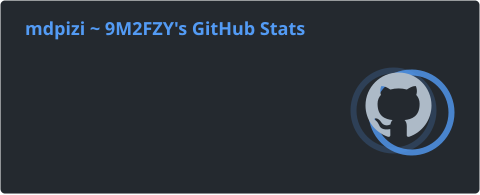
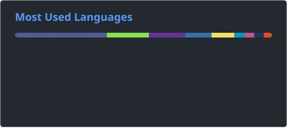
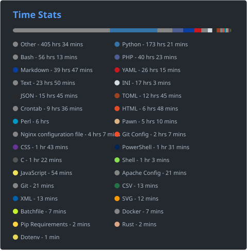

# Hi there 👋

<div style="text-align: center;">


<table style="margin-left: auto; margin-right: auto;">
  <tr><th colspan="2" style="text-align: center;">Repositories</th></tr>
  <tr><td style="text-align: end;">GitHub</td><td><a href="https://github.com/HafiziRuslan">HafiziRuslan</a></td></tr>
  <tr><td style="text-align: end;">Gist.GitHub</td><td><a href="https://gist.github.com/HafiziRuslan">HafiziRuslan</a></td></tr>
  <tr><td style="text-align: end;">GitLab</td><td><a href="https://gitlab.com/hafiziruslan">hafiziruslan</a></td></tr>
  <tr><td style="text-align: end;">Codeberg</td><td><a href="https://codeberg.org/hafiziruslan">hafiziruslan</a></td></tr>
  <tr><td style="text-align: end;">Gitea</td><td><a href="https://gitea.com/HafiziRuslan">HafiziRuslan</a></td></tr>
  <tr><td style="text-align: end;">WPSD-Dev</td><td><a href="https://repo.w0chp.net/9w2lgx">9W2LGX</a></td></tr>
</table>

</div>

## About

<div style="text-align: center;">








</div>

<!--
**HafiziRuslan** is a ✨ _special_ ✨ repository because its `README.md` (this file) appears on your GitHub profile.

Here are some ideas to get you started:

- 🔭 I’m currently working on ...
- 🌱 I’m currently learning ...
- 👯 I’m looking to collaborate on ...
- 🤔 I’m looking for help with ...
- 💬 Ask me about ...
- 📫 How to reach me: ...
- 😄 Pronouns: ...
- ⚡ Fun fact: ...
-->

<!--START_SECTION:waka-->


**🐱 My GitHub Data** 

> 📦 58.9 kB Used in GitHub's Storage 
 > 
> 🏆 1,407 Contributions in the Year 2026
 > 
> 💼 Opted to Hire
 > 
> 📜 12 Public Repositories 
 > 
> 🔑 2 Private Repositories 
 > 
**I'm a Night 🦉** 

```text
🌞 Morning                762 commits         ⣿⣿⣿⣿⣀⣀⣀⣀⣀⣀⣀⣀⣀⣀⣀⣀⣀⣀⣀⣀⣀⣀⣀⣀⣀   17.00 % 
🌆 Daytime                765 commits         ⣿⣿⣿⣿⣀⣀⣀⣀⣀⣀⣀⣀⣀⣀⣀⣀⣀⣀⣀⣀⣀⣀⣀⣀⣀   17.06 % 
🌃 Evening                1274 commits        ⣿⣿⣿⣿⣿⣿⣿⣀⣀⣀⣀⣀⣀⣀⣀⣀⣀⣀⣀⣀⣀⣀⣀⣀⣀   28.42 % 
🌙 Night                  1682 commits        ⣿⣿⣿⣿⣿⣿⣿⣿⣿⣀⣀⣀⣀⣀⣀⣀⣀⣀⣀⣀⣀⣀⣀⣀⣀   37.52 % 
```
📅 **I'm Most Productive on Thursday** 

```text
Monday                   684 commits         ⣿⣿⣿⣿⣀⣀⣀⣀⣀⣀⣀⣀⣀⣀⣀⣀⣀⣀⣀⣀⣀⣀⣀⣀⣀   15.26 % 
Tuesday                  803 commits         ⣿⣿⣿⣿⣀⣀⣀⣀⣀⣀⣀⣀⣀⣀⣀⣀⣀⣀⣀⣀⣀⣀⣀⣀⣀   17.91 % 
Wednesday                788 commits         ⣿⣿⣿⣿⣀⣀⣀⣀⣀⣀⣀⣀⣀⣀⣀⣀⣀⣀⣀⣀⣀⣀⣀⣀⣀   17.58 % 
Thursday                 817 commits         ⣿⣿⣿⣿⣿⣀⣀⣀⣀⣀⣀⣀⣀⣀⣀⣀⣀⣀⣀⣀⣀⣀⣀⣀⣀   18.22 % 
Friday                   514 commits         ⣿⣿⣿⣀⣀⣀⣀⣀⣀⣀⣀⣀⣀⣀⣀⣀⣀⣀⣀⣀⣀⣀⣀⣀⣀   11.47 % 
Saturday                 448 commits         ⣿⣿⣀⣀⣀⣀⣀⣀⣀⣀⣀⣀⣀⣀⣀⣀⣀⣀⣀⣀⣀⣀⣀⣀⣀   09.99 % 
Sunday                   429 commits         ⣿⣿⣀⣀⣀⣀⣀⣀⣀⣀⣀⣀⣀⣀⣀⣀⣀⣀⣀⣀⣀⣀⣀⣀⣀   09.57 % 
```


📊 **This Week I Spent My Time On** 

```text
🐱‍💻 Projects: 
RasPi-Backups            1 hr 29 mins        ⣿⣿⣿⣿⣿⣿⣿⣿⣿⣿⣿⣿⣀⣀⣀⣀⣀⣀⣀⣀⣀⣀⣀⣀⣀   48.55 % 
RasPiAPRS                1 hr 2 mins         ⣿⣿⣿⣿⣿⣿⣿⣿⣀⣀⣀⣀⣀⣀⣀⣀⣀⣀⣀⣀⣀⣀⣀⣀⣀   33.98 % 
MMDVM-LastHeard          32 mins             ⣿⣿⣿⣿⣀⣀⣀⣀⣀⣀⣀⣀⣀⣀⣀⣀⣀⣀⣀⣀⣀⣀⣀⣀⣀   17.47 % 

💻 Operating System: 
Windows                  3 hrs 3 mins        ⣿⣿⣿⣿⣿⣿⣿⣿⣿⣿⣿⣿⣿⣿⣿⣿⣿⣿⣿⣿⣿⣿⣿⣿⣿   100.00 % 
```

**Timeline**


<!--END_SECTION:waka-->

<!--RECENT_ACTIVITY:last_update-->

<!--RECENT_ACTIVITY:start-->
